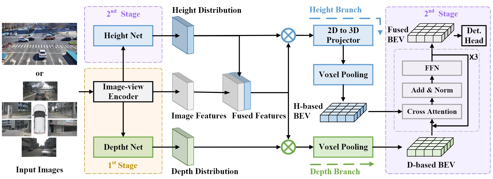

<p align="center">

  <h1 align="center">BEVHeight++: Toward Robust Visual Centric 3D Object Detection</h1>
  <p align="center">
    <a href="https://scholar.google.com/citations?user=EUnI2nMAAAAJ&hl=zh-CN"><strong>Lei Yang</strong></a>
    · 
    <a href="https://scholar.google.com.hk/citations?user=1ltylFwAAAAJ&hl=zh-CN&oi=sra"><strong>Tao Tang</strong></a>
    ·
    <a href="https://www.tsinghua.edu.cn/"><strong>Jun Li</strong></a>
    ·
    <a href="https://scholar.google.com.hk/citations?user=aMnHLz4AAAAJ&hl=zh-CN&oi=ao"><strong>Kun Yuan</strong></a>
    ·
    <a href="https://damo.alibaba.com/labs/intelligent-transportation"><strong>Peng Chen</strong></a>
    ·
    <a href="https://scholar.google.com.hk/citations?user=kLTnwAsAAAAJ&hl=zh-CN&oi=sra"><strong>Li Wang</strong></a>
    ·
    <a href="https://scholar.google.com.hk/citations?user=0Q7pN4cAAAAJ&hl=zh-CN&oi=sra"><strong>Xinyu Zhang</strong></a>
    ·
    <a href="https://scholar.google.com.hk/citations?user=Jtmq_m0AAAAJ&hl=zh-CN&oi=sra"><strong>Kaicheng Yu</strong></a>

  </p>


<h2 align="center">CVPR 2023</h2>
  <div align="center">
    
  </div>

<p align="center">
  <br>
    <a href="https://pytorch.org/get-started/locally/"></a>
    <a href="https://pytorchlightning.ai/"></a>
     <a href='https://hub.docker.com/repository/docker/yanglei2024/op-bevheight/general'></a>
    <br></br>
    </a>
  </p>
</p>

**BEVHeight++** is a new vision-based 3D object detector specially designed for both roadside and vihicle-side scenarios. On popular 3D detection benchmarks of roadside cameras, BEVHeight++ surpasses all previous vision-centric methods by a significant margin. In terms of the ego-vehicle scenario, our BEVHeight++ also possesses superior over depth-only methods.

# News

- [2024/06/30] Both arXiv and codebase are released!
# Incoming

- [ ] Release the pretrained models

<br>

<!-- TABLE OF CONTENTS -->
<details open="open" style='padding: 10px; border-radius:5px 30px 30px 5px; border-style: solid; border-width: 1px;'>
  <summary>Table of Contents</summary>
  <ol>
    <li>
      <a href="#Getting Started">Getting Started</a>
    </li>
    <li>
      <a href="#Acknowledgment">Acknowledgment</a>
    </li>
    <li>
      <a href="#Citation">Citation</a>
    </li>
  </ol>
</details>

<br/>

# Getting Started

- [Installation](docs/install.md)
- [Prepare Dataset](docs/prepare_dataset.md)

Train BEVHeight with 8 GPUs
```
python [EXP_PATH] --amp_backend native -b 8 --gpus 8
```
Eval BEVHeight with 8 GPUs
```
python [EXP_PATH] --ckpt_path [CKPT_PATH] -e -b 8 --gpus 8
```

# Acknowledgment
This project is not possible without the following codebases.
* [BEVDepth](https://github.com/Megvii-BaseDetection/BEVDepth)
* [DAIR-V2X](https://github.com/AIR-THU/DAIR-V2X)
* [pypcd](https://github.com/dimatura/pypcd)

# Citation
If you use BEVHeight in your research, please cite our work by using the following BibTeX entry:
```
@article{yang2023bevheight++,
  title={Bevheight++: Toward robust visual centric 3d object detection},
  author={Yang, Lei and Tang, Tao and Li, Jun and Chen, Peng and Yuan, Kun and Wang, Li and Huang, Yi and Zhang, Xinyu and Yu, Kaicheng},
  journal={arXiv preprint arXiv:2309.16179},
  year={2023}
}
```
